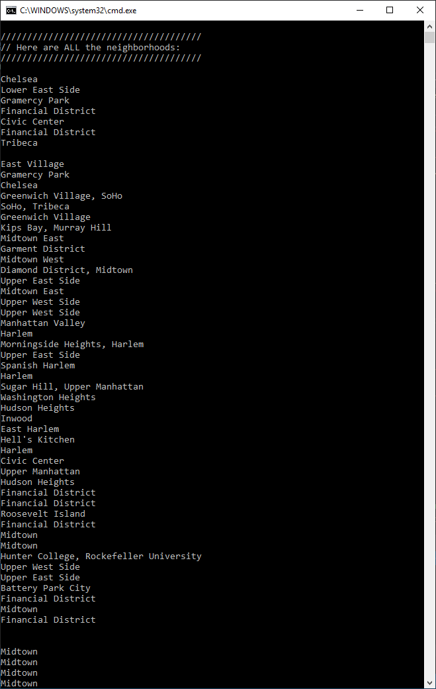
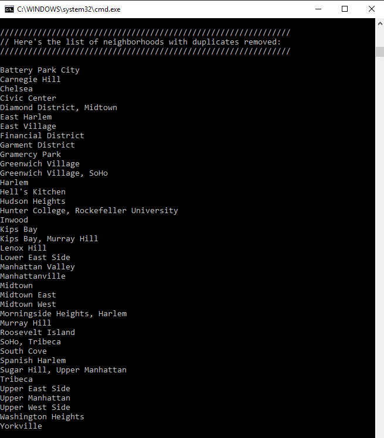

# Code 401 Lab 08: LINQ in Manhattan 
#### Lab08_LINQ_In_Manhattan
##### *Author: Andrew Curtis*

## Description

This is a C# console app that reads a JSON file containing data on neighborhoods in Manhattan, NYC, and uses LINQ to query and filter the data and then outputs the results to the console. 


## Running This App on Your Computer

To run this app yourself, clone this repository to your local machine.
```
$ git clone https://github.com/amjcurtis/Lab07_LendingLibrary.git
```

#### To run the program from Visual Studio:
Select `File` -> `Open` -> `Project/Solution`

Next navigate to the location where you cloned the repository.

Double-click on the `Lab08_LINQ_In_Manhattan` directory.

Then select and open `Lab08_LINQ_In_Manhattan.sln`


## Visuals

##### Neighborhood Data Before Filtering



##### Neighborhood Names with Duplicates Removed




## Attribution

* I got in-person help from Jason Few in several areas of this project:
    * Discovering the StreamReader.ReadToEnd() method 
    * Instantiating my `RootObject` object after deserializing my JSON
    * Learning how to drill down into the deserialized JSON to access the properties I wanted
* I also used an idea I got from Stack Overflow for how to use .GroupBy() and .First() with lambda expressions as an alternative to the .Distinct() method which doesn't work with 